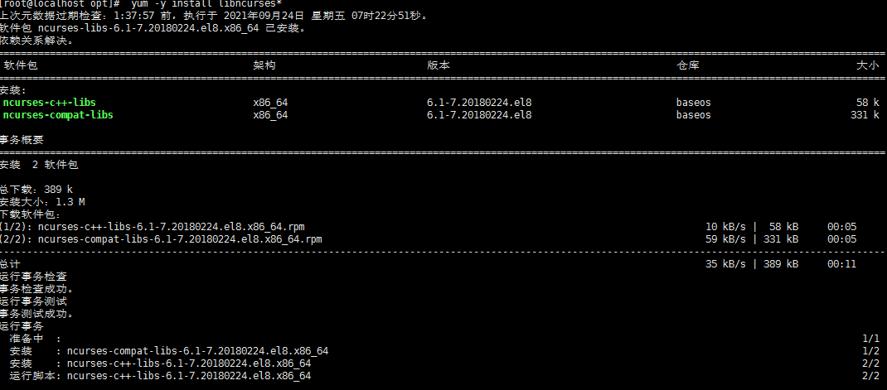

# mysql基础

## [1]MySQL5.5安装配置

###  1.xshell连接虚拟机CentOS8(桥接模式)


### 2.CentOS 8下安装mysql5.5

1.下载mysql-server和mysql-client的rpm包

```
https://downloads.mysql.com/archives/community/
```

2.使用xftp将两个rpm包上传到/opt目录下

3.检查当前系统是否安装过mysql,没有安装则什么都不显示

```
rpm -qa|grep -i mysql
```

4.如果装过mysql,删除命令

由于有些版本自带的有mariadb，检查是否有mariadb，若是有需要先卸载 

```
rpm -e RPM软件包名

注:软件包名是rmp -qa|greap -i mysql 查询出来的名字

yum -y remove maria*
```

5.先在/opt目录下安装mysql-server 

```
##安装mysql服务server
[root@localhost opt]# rpm -ivh MySQL-server-5.5.48-1.linux2.6.x86_64.rpm 
警告：MySQL-server-5.5.48-1.linux2.6.x86_64.rpm: 头V3 DSA/SHA1 Signature, 密钥 ID 5072e1f5: NOKEY
准备中...                          ################################# [100%]
正在升级/安装...
   1:MySQL-server-5.5.48-1.linux2.6   ################################# [100%]
210925  8:05:42 [Note] /usr/sbin/mysqld (mysqld 5.5.48) starting as process 7367 ...
210925  8:05:43 [Note] /usr/sbin/mysqld (mysqld 5.5.48) starting as process 7374 ...

PLEASE REMEMBER TO SET A PASSWORD FOR THE MySQL root USER !
To do so, start the server, then issue the following commands:

/usr/bin/mysqladmin -u root password 'new-password'
/usr/bin/mysqladmin -u root -h localhost.localdomain password 'new-password'

Alternatively you can run:
/usr/bin/mysql_secure_installation

which will also give you the option of removing the test
databases and anonymous user created by default.  This is
strongly recommended for production servers.

See the manual for more instructions.

Please report any problems at http://bugs.mysql.com/
```


6.安装mysql-client

```
##安装mysql客户端client
[root@localhost opt]# rpm -ivh MySQL-client-5.5.48-1.linux2.6.x86_64.rpm 
警告：MySQL-client-5.5.48-1.linux2.6.x86_64.rpm: 头V3 DSA/SHA1 Signature, 密钥 ID 5072e1f5: NOKEY
Verifying...                          ################################# [100%]
准备中...                          ################################# [100%]
正在升级/安装...
   1:MySQL-client-5.5.48-1.linux2.6   ################################# [100%]

```


> Tips:如果安装MYSQL-client出现依赖错误:

```
警告：MySQL-client-5.5.48-1.linux2.6.x86_64.rpm: 头V3 DSA/SHA1 Signature, 密钥 ID 5072e1f5: NOKEY
错误：依赖检测失败：
	libncurses.so.5()(64bit) 被 MySQL-client-5.5.48-1.linux2.6.x86_64 需要
```

解决方法:

需要安装两个依赖

```
ncurses-c++-libs-6.1-7.20180224.el8.x86_64                  
ncurses-compat-libs-6.1-7.20180224.el8.x86_64
```

```
安装命令:
yum -y install libncurses*
```




7.查看Mysql安装时创建的mysql用户组和mysql组

```
##查看Mysql安装时创建的mysql用户组
[root@localhost opt]# cat /etc/passwd|grep mysql
mysql:x:975:974:MySQL server:/var/lib/mysql:/bin/bash
##查看Mysql安装时创建的mysql组
[root@localhost opt]# cat /etc/group|grep mysql
mysql:x:974:
```


8.查看mysql版本

```
##查看mysql版本
[root@localhost opt]# mysqladmin --version
mysqladmin  Ver 8.42 Distrib 5.5.48, for Linux on x86_64
```


### 3. 启动关闭Mysql

```
##后台启动mysql服务
[root@localhost opt]# service mysql start
Starting MySQL.... SUCCESS! 
```

```
##查看mysql启动状态
[root@localhost opt]# ps -ef|grep mysql
root      7450     1  0 08:09 ?        00:00:00 /bin/sh /usr/bin/mysqld_safe --datadir=/var/lib/mysql --pid-file=/var/lib/mysql/localhost.localdomain.pid
mysql     7543  7450  0 08:09 ?        00:00:00 /usr/sbin/mysqld --basedir=/usr --datadir=/var/lib/mysql --plugin-dir=/usr/lib64/mysql/plugin --user=mysql --log-error=/var/lib/mysql/localhost.localdomain.err --pid-file=/var/lib/mysql/localhost.localdomain.pid
root      7606  6859  0 08:11 pts/1    00:00:00 grep --color=auto mysql
```

```
##此时没有设置mysql root密码　，可以直接登录．用来验证mysql是否启动成功
[root@localhost opt]# mysql
Welcome to the MySQL monitor.  Commands end with ; or \g.
Your MySQL connection id is 1
Server version: 5.5.48 MySQL Community Server (GPL)

Copyright (c) 2000, 2016, Oracle and/or its affiliates. All rights reserved.

Oracle is a registered trademark of Oracle Corporation and/or its
affiliates. Other names may be trademarks of their respective
owners.

Type 'help;' or '\h' for help. Type '\c' to clear the current input statement.

mysql> 

```


>  Tips:CentOS8启动MySQL时报错:

```
Starting MySQL. ERROR! The server quit without updating PID file
```

产生原因:

?

解决方法:

```
?
```


```
##关闭mysql服务
[root@localhost opt]# service mysql stop
Shutting down MySQL. SUCCESS! 

##或者通过脚本关闭
/etc/init.d/mysql stop
```


### 4.设置root密码

```sql
##设置root密码
[root@localhost opt]# /usr/bin/mysqladmin -u root password 123456

##设置完密码后,进行mysql无密码登录会失败
[root@localhost opt]# mysql
ERROR 1045 (28000): Access denied for user 'root'@'localhost' (using password: NO)

##输入root用户和密码后可以使用mysql
[root@localhost opt]# mysql -u root -p
Enter password: 
Welcome to the MySQL monitor.  Commands end with ; or \g.
Your MySQL connection id is 6
Server version: 5.5.48 MySQL Community Server (GPL)

Copyright (c) 2000, 2016, Oracle and/or its affiliates. All rights reserved.

Oracle is a registered trademark of Oracle Corporation and/or its
affiliates. Other names may be trademarks of their respective
owners.

Type 'help;' or '\h' for help. Type '\c' to clear the current input statement.

mysql> 

```


### 5.设置开机自启动

```
##设置开机自启动
[root@localhost opt]# chkconfig mysql on

##查看mysql的自启动情况
[root@localhost opt]# chkconfig --list|grep mysql

注：该输出结果只显示 SysV 服务，并不包含
原生 systemd 服务。SysV 配置数据
可能被原生 systemd 配置覆盖。 

      要列出 systemd 服务，请执行 'systemctl list-unit-files'。
      查看在具体 target 启用的服务请执行
      'systemctl list-dependencies [target]'。

mysql          	0:关	1:关	2:开	3:开	4:开	5:开	6:关

##图形化展示查看当前系统自启动项,如果mysql自启动,则展示为 [*]mysql
[root@localhost opt]# ntsysv
```


### 6.Mysql安装位置

```
##通过 ps -ef|grep mysql 查看mysql安装目录
[root@localhost opt]# ps -ef|grep mysql
root      7662     1  0 08:14 ?        00:00:00 /bin/sh /usr/bin/mysqld_safe --datadir=/var/lib/mysql --pid-file=/var/lib/mysql/localhost.localdomain.pid
mysql     7753  7662  0 08:14 ?        00:00:00 /usr/sbin/mysqld --basedir=/usr --datadir=/var/lib/mysql --plugin-dir=/usr/lib64/mysql/plugin --user=mysql --log-error=/var/lib/mysql/localhost.localdomain.err --pid-file=/var/lib/mysql/localhost.localdomain.pid
root      8275  6859  0 08:38 pts/1    00:00:00 grep --color=auto mysql
```

Linux下mysql的路径解释:

| 路径              | 解释                  | 备注                             |
| ----------------- | --------------------- | -------------------------------- |
| /var/lib/mysql/   | mysql数据库的存放路径 | /var/lib/mysql/atguigu.cloud.pid |
| /usr/share/mysql  | 配置文件目录          | mysql.server命令及配置文件       |
| /usr/bin          | 相关命令目录          | mysqladmin  mysqldump等命令      |
| /etc/init.d/mysql | 启动停止相关脚本      |                                  |


### 7.修改配置文件位置

#### 1.查看配置文件/usr/share/mysql目录下

```
##查看mysql配置文件列表
[root@localhost share]# cd /usr/share/mysql/
[root@localhost mysql]# ll
总用量 1268
-rwxr-xr-x. 1 root root   1153 1月  15 2016 binary-configure
drwxr-xr-x. 2 root root   4096 9月  25 08:05 charsets
-rwxr-xr-x. 1 root root   4528 1月  15 2016 config.huge.ini
-rwxr-xr-x. 1 root root   2382 1月  15 2016 config.medium.ini
-rwxr-xr-x. 1 root root   1626 1月  15 2016 config.small.ini
drwxr-xr-x. 2 root root     24 9月  25 08:05 czech
drwxr-xr-x. 2 root root     24 9月  25 08:05 danish
drwxr-xr-x. 2 root root     24 9月  25 08:05 dutch
drwxr-xr-x. 2 root root     24 9月  25 08:05 english
-rwxr-xr-x. 1 root root 470520 1月  15 2016 errmsg-utf8.txt
drwxr-xr-x. 2 root root     24 9月  25 08:05 estonian
-rwxr-xr-x. 1 root root 673773 1月  15 2016 fill_help_tables.sql
drwxr-xr-x. 2 root root     24 9月  25 08:05 french
drwxr-xr-x. 2 root root     24 9月  25 08:05 german
drwxr-xr-x. 2 root root     24 9月  25 08:05 greek
drwxr-xr-x. 2 root root     24 9月  25 08:05 hungarian
drwxr-xr-x. 2 root root     24 9月  25 08:05 italian
drwxr-xr-x. 2 root root     24 9月  25 08:05 japanese
drwxr-xr-x. 2 root root     24 9月  25 08:05 korean
-rwxr-xr-x. 1 root root    773 1月  15 2016 magic
-rwxr-xr-x. 1 root root   4697 1月  15 2016 my-huge.cnf
-rwxr-xr-x. 1 root root  19779 1月  15 2016 my-innodb-heavy-4G.cnf
-rwxr-xr-x. 1 root root   4671 1月  15 2016 my-large.cnf
-rwxr-xr-x. 1 root root   4682 1月  15 2016 my-medium.cnf
-rwxr-xr-x. 1 root root   2846 1月  15 2016 my-small.cnf
-rwxr-xr-x. 1 root root   1061 1月  15 2016 mysqld_multi.server
-rwxr-xr-x. 1 root root    789 1月  15 2016 mysql-log-rotate
-rwxr-xr-x. 1 root root  10815 1月  15 2016 mysql.server
-rwxr-xr-x. 1 root root   3448 1月  15 2016 mysql_system_tables_data.sql
-rwxr-xr-x. 1 root root  28980 1月  15 2016 mysql_system_tables.sql
-rwxr-xr-x. 1 root root  10411 1月  15 2016 mysql_test_data_timezone.sql
-rwxr-xr-x. 1 root root   1326 1月  15 2016 ndb-config-2-node.ini
drwxr-xr-x. 2 root root     24 9月  25 08:05 norwegian
drwxr-xr-x. 2 root root     24 9月  25 08:05 norwegian-ny
drwxr-xr-x. 2 root root     24 9月  25 08:05 polish
drwxr-xr-x. 2 root root     24 9月  25 08:05 portuguese
drwxr-xr-x. 2 root root     24 9月  25 08:05 romanian
drwxr-xr-x. 2 root root     24 9月  25 08:05 russian
drwxr-xr-x. 3 root root     19 9月  25 08:05 SELinux
drwxr-xr-x. 2 root root     24 9月  25 08:05 serbian
drwxr-xr-x. 2 root root     24 9月  25 08:05 slovak
drwxr-xr-x. 2 root root     24 9月  25 08:05 spanish
drwxr-xr-x. 2 root root     24 9月  25 08:05 swedish
drwxr-xr-x. 2 root root     24 9月  25 08:05 ukrainian

```


#### 2.复制my-huge.cnf到/etc/my.cnf

```
##复制mysql的mu-huge.cnf配置文件到/etc/my.cnf (mysql5.5)
[root@localhost ]# cp /usr/share/mysql/my-huge.cnf /etc/my.cnf

##tips:mysql5.6后要用
cp /usr/share/mysql/my-default.cnf /etc/my.cnf
```


> Tips:未修改之前的字符集 character_set_database   和character_set_server   是latin1  ,插入中文数据会乱码!

```
##查看字符集,
mysql> show variables like '%char%';
+--------------------------+----------------------------+
| Variable_name            | Value                      |
+--------------------------+----------------------------+
| character_set_client     | utf8                       |
| character_set_connection | utf8                       |
| character_set_database   | latin1                     |
| character_set_filesystem | binary                     |
| character_set_results    | utf8                       |
| character_set_server     | latin1                     |
| character_set_system     | utf8                       |
| character_sets_dir       | /usr/share/mysql/charsets/ |
+--------------------------+----------------------------+
8 rows in set (0.00 sec)
```


#### 3.修改配置文件/etc/my.cnf的内容

```
[client]
#password	= your_password
port		= 3306
socket		= /var/lib/mysql/mysql.sock
default-character-set=utf8  (添加此处)

[mysqld]
port		= 3306
character_set_server=utf8		(添加此处)
character_set_client=utf8		(添加此处)
collation-server=utf8_general_ci		(添加此处)

[mysql]
no-auto-rehash
default-character-set=utf8	(添加此处)
```


>  Tips:以下是完整的修改完成的my.cnf文件,可以直接复制使用

```
##修改配置my.cnf文件,将

[root@localhost mysql]# vi /etc/my.cnf
# Example MySQL config file for very large systems.
#
# This is for a large system with memory of 1G-2G where the system runs mainly
# MySQL.
#
# MySQL programs look for option files in a set of
# locations which depend on the deployment platform.
# You can copy this option file to one of those
# locations. For information about these locations, see:
# http://dev.mysql.com/doc/mysql/en/option-files.html
#
# In this file, you can use all long options that a program supports.
# If you want to know which options a program supports, run the program
# with the "--help" option.

# The following options will be passed to all MySQL clients
[client]
#password	= your_password
port		= 3306
socket		= /var/lib/mysql/mysql.sock
default-character-set=utf8  

# Here follows entries for some specific programs

# The MySQL server
[mysqld]
port		= 3306
character_set_server=utf8		
character_set_client=utf8		
collation-server=utf8_general_ci		
socket		= /var/lib/mysql/mysql.sock
skip-external-locking
key_buffer_size = 384M
max_allowed_packet = 1M
table_open_cache = 512
sort_buffer_size = 2M
read_buffer_size = 2M
read_rnd_buffer_size = 8M
myisam_sort_buffer_size = 64M
thread_cache_size = 8
query_cache_size = 32M
# Try number of CPU's*2 for thread_concurrency
thread_concurrency = 8

# Don't listen on a TCP/IP port at all. This can be a security enhancement,
# if all processes that need to connect to mysqld run on the same host.
# All interaction with mysqld must be made via Unix sockets or named pipes.
# Note that using this option without enabling named pipes on Windows
# (via the "enable-named-pipe" option) will render mysqld useless!
# 
#skip-networking

# Replication Master Server (default)
# binary logging is required for replication
log-bin=mysql-bin

# required unique id between 1 and 2^32 - 1
# defaults to 1 if master-host is not set
# but will not function as a master if omitted
server-id	= 1

# Replication Slave (comment out master section to use this)
#
# To configure this host as a replication slave, you can choose between
# two methods :
#
# 1) Use the CHANGE MASTER TO command (fully described in our manual) -
#    the syntax is:
#
#    CHANGE MASTER TO MASTER_HOST=<host>, MASTER_PORT=<port>,
#    MASTER_USER=<user>, MASTER_PASSWORD=<password> ;
#
#    where you replace <host>, <user>, <password> by quoted strings and
#    <port> by the master's port number (3306 by default).
#
#    Example:
#
#    CHANGE MASTER TO MASTER_HOST='125.564.12.1', MASTER_PORT=3306,
#    MASTER_USER='joe', MASTER_PASSWORD='secret';
#
# OR
#
# 2) Set the variables below. However, in case you choose this method, then
#    start replication for the first time (even unsuccessfully, for example
#    if you mistyped the password in master-password and the slave fails to
#    connect), the slave will create a master.info file, and any later
#    change in this file to the variables' values below will be ignored and
#    overridden by the content of the master.info file, unless you shutdown
#    the slave server, delete master.info and restart the slaver server.
#    For that reason, you may want to leave the lines below untouched
#    (commented) and instead use CHANGE MASTER TO (see above)
#
# required unique id between 2 and 2^32 - 1
# (and different from the master)
# defaults to 2 if master-host is set
# but will not function as a slave if omitted
#server-id       = 2
#
# The replication master for this slave - required
#master-host     =   <hostname>
#
# The username the slave will use for authentication when connecting
# to the master - required
#master-user     =   <username>
#
# The password the slave will authenticate with when connecting to
# the master - required
#master-password =   <password>
#
# The port the master is listening on.
# optional - defaults to 3306
#master-port     =  <port>
#
# binary logging - not required for slaves, but recommended
#log-bin=mysql-bin
#
# binary logging format - mixed recommended 
#binlog_format=mixed

# Uncomment the following if you are using InnoDB tables
#innodb_data_home_dir = /var/lib/mysql
#innodb_data_file_path = ibdata1:2000M;ibdata2:10M:autoextend
#innodb_log_group_home_dir = /var/lib/mysql
# You can set .._buffer_pool_size up to 50 - 80 %
# of RAM but beware of setting memory usage too high
#innodb_buffer_pool_size = 384M
#innodb_additional_mem_pool_size = 20M
# Set .._log_file_size to 25 % of buffer pool size
#innodb_log_file_size = 100M
#innodb_log_buffer_size = 8M
#innodb_flush_log_at_trx_commit = 1
#innodb_lock_wait_timeout = 50

[mysqldump]
quick
max_allowed_packet = 16M

[mysql]
no-auto-rehash
default-character-set=utf8	
# Remove the next comment character if you are not familiar with SQL
#safe-updates

[myisamchk]
key_buffer_size = 256M
sort_buffer_size = 256M
read_buffer = 2M
write_buffer = 2M

[mysqlhotcopy]
interactive-timeout


```


#### 4.修改后要重启mysql

```
###修改后重启mysql
[root@localhost mysql]# service mysql stop
Shutting down MySQL. SUCCESS! 
[root@localhost mysql]# service mysql start
Starting MySQL.. SUCCESS! 
```


> Tips:如果是在修改配置文件之前建的库,则还是乱码!

```
mysql> insert into user values(3,"李四");
Query OK, 1 row affected, 1 warning (0.01 sec)

mysql> select * from user;
+----+------+
| id | name |
+----+------+
|  1 | z3   |
|  2 | ??   |
|  3 | ??   |
+----+------+
3 rows in set (0.00 sec)
```


#### 5.打开mysql,重新建库建表.

```
##修改完my.cnf配置文件后,建立的库是utf8格式的,不会乱码
mysql> create database db02;
Query OK, 1 row affected (0.00 sec)

mysql> use db02
Database changed
mysql> 
mysql> show tables;
Empty set (0.00 sec)

mysql> create table user;
ERROR 1113 (42000): A table must have at least 1 column
mysql> create table user(id int not null,name varchar(20));
Query OK, 0 rows affected (0.01 sec)

mysql> insert into user values(1,"小明");
Query OK, 1 row affected (0.01 sec)

mysql> select * from user;
+----+--------+
| id | name   |
+----+--------+
|  1 | 小明   |
+----+--------+
1 row in set (0.00 sec)

```
