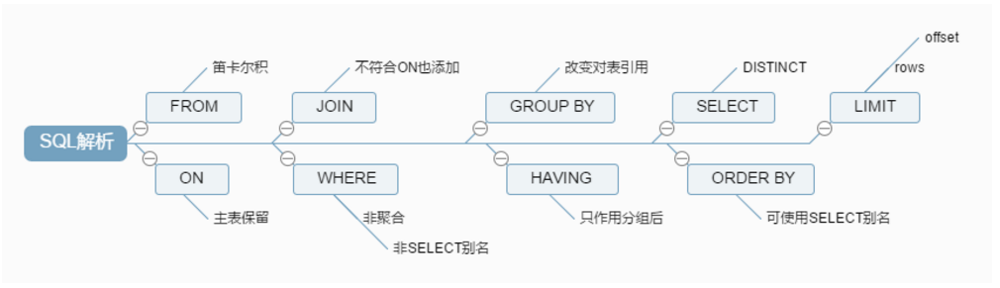
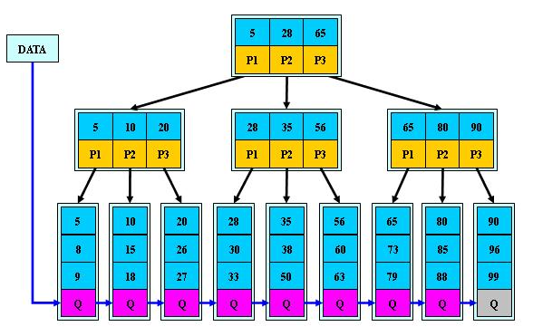
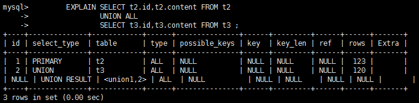
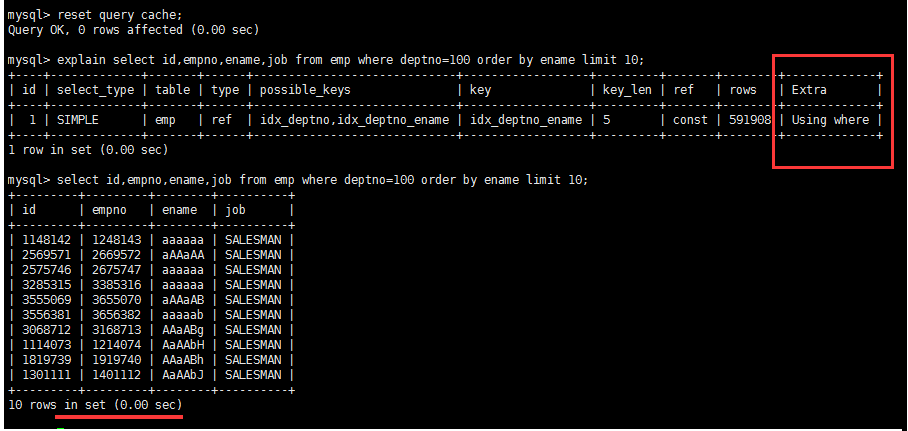

## [4]Mysql索引优化

### 1.性能下降的原因

#### 1.1 查询语句写的烂

能不能拆，条件过滤尽量少

select * from user where name='test';   查询语句慢.

可以给加上索引

#单字段索引

create index idx_user_name on user(name);

##双字段索引

create index idx_user_userEmail on user(name,email);


####  1.2 索引失效

 

索引针对 列 建索引。但并不可能每一列都建索引
索引并非越多越好。当数据更新了，索引会进行调整。也会很消耗性能。
且 mysql 并不会把所有索引都用上，只会根据其算法挑一个索引用。所以建的准很重要。

- 单值

- 复合
  - 条件多时，可以建共同索引(混合索引)。混合索引一般会偶先使用。有些情况下，就算有索引具体执行时也不会被使用。


####  1.3 关联查询太多的join

join 原理。用  A 表的每一条数据 扫描 B表的所有数据。所以尽量先过滤。


#### 1.4服务器调优及各个参数设置


### 2.常见的join查询

#### 2.1 SQL执行顺序

程序员手写代码的顺序:


Mysql解析的顺序:

随着Mysql版本的更新换代，其优化器也在不断的升级，优化器会分析不同执行顺序产生的性能消耗不同而动态调整执行顺序。下面是经常出现的查询顺序：




先从FROM开始解析!


####  2.2 join图


##### 1. AB共有


##### 2.A和AB共有


##### 3.B和AB共有


##### 4.仅A


##### 5.仅B


##### 6.全A全B


##### 7.全A全B但不包括AB共有


什么叫共有，什么叫独有？
共有：满足 a.deptid = b.id 的叫共有
A独有:  A 表中所有不满足  a.deptid = b.id  连接关系的数据
同时参考 join 图


#### 2.3 建表SQL

```sql
CREATE TABLE `t_dept` (
 `id` INT(11) NOT NULL AUTO_INCREMENT,
 `deptName` VARCHAR(30) DEFAULT NULL,
 `address` VARCHAR(40) DEFAULT NULL,
 PRIMARY KEY (`id`)
) ENGINE=INNODB AUTO_INCREMENT=1 DEFAULT CHARSET=utf8;
 
CREATE TABLE `t_emp` (
 `id` INT(11) NOT NULL AUTO_INCREMENT,
 `name` VARCHAR(20) DEFAULT NULL,
  `age` INT(3) DEFAULT NULL,
 `deptId` INT(11) DEFAULT NULL,
 PRIMARY KEY (`id`),
 KEY `fk_dept_id` (`deptId`)
 #CONSTRAINT `fk_dept_id` FOREIGN KEY (`deptId`) REFERENCES `t_dept` (`id`)
) ENGINE=INNODB AUTO_INCREMENT=1 DEFAULT CHARSET=utf8;
 
INSERT INTO t_dept(deptName,address) VALUES('华山','华山');
INSERT INTO t_dept(deptName,address) VALUES('丐帮','洛阳');
INSERT INTO t_dept(deptName,address) VALUES('峨眉','峨眉山');
INSERT INTO t_dept(deptName,address) VALUES('武当','武当山');
INSERT INTO t_dept(deptName,address) VALUES('明教','光明顶');
 INSERT INTO t_dept(deptName,address) VALUES('少林','少林寺');
 
INSERT INTO t_emp(NAME,age,deptId) VALUES('风清扬',90,1);
INSERT INTO t_emp(NAME,age,deptId) VALUES('岳不群',50,1);
INSERT INTO t_emp(NAME,age,deptId) VALUES('令狐冲',24,1);
 
 INSERT INTO t_emp(NAME,age,deptId) VALUES('洪七公',70,2);
INSERT INTO t_emp(NAME,age,deptId) VALUES('乔峰',35,2);
 
INSERT INTO t_emp(NAME,age,deptId) VALUES('灭绝师太',70,3);
INSERT INTO t_emp(NAME,age,deptId) VALUES('周芷若',20,3);

INSERT INTO t_emp(NAME,age,deptId) VALUES('张三丰',100,4);
 
INSERT INTO t_emp(NAME,age,deptId) VALUES('张无忌',25,5);
 
INSERT INTO t_emp(NAME,age,deptId) VALUES('韦小宝',18,null);

```


#### 2.4 7种join

```sql
## t_emp(部门表) a
mysql> select * from t_emp;
+----+--------------+------+--------+
| id | name         | age  | deptId |
+----+--------------+------+--------+
|  1 | 风清扬       |   90 |      1 |
|  2 | 岳不群       |   50 |      1 |
|  3 | 令狐冲       |   24 |      1 |
|  4 | 洪七公       |   70 |      2 |
|  5 | 乔峰           |   35 |      2 |
|  6 | 灭绝师太    |   70 |      3 |
|  7 | 周芷若       |   20 |      3 |
|  8 | 张三丰       |  100 |      4 |
|  9 | 张无忌       |   25 |      5 |
| 10 | 韦小宝       |   18 |   NULL |
+----+--------------+------+--------+
10 rows in set (0.00 sec)

## t_dept(部门表) b
mysql> select * from t_dept;
+----+----------+-----------+
| id | deptName | address   |
+----+----------+-----------+
|  1 | 华山     | 华山       |
|  2 | 丐帮     | 洛阳       |
|  3 | 峨眉     | 峨眉山    |
|  4 | 武当     | 武当山    |
|  5 | 明教     | 光明顶    |
|  6 | 少林     | 少林寺    |
+----+----------+-----------+
6 rows in set (0.00 sec)
```


##### 1. A、B两表共有

```sql
mysql> select * from t_emp a inner join t_dept b on a.deptId = b.id;
+----+--------------+------+--------+----+----------+-----------+
| id | name         | age  | deptId | id | deptName | address   |
+----+--------------+------+--------+----+----------+-----------+
|  1 | 风清扬       |   90 |      1 |  1 | 华山     | 华山      |
|  2 | 岳不群       |   50 |      1 |  1 | 华山     | 华山      |
|  3 | 令狐冲       |   24 |      1 |  1 | 华山     | 华山      |
|  4 | 洪七公       |   70 |      2 |  2 | 丐帮     | 洛阳      |
|  5 | 乔峰         |   35 |      2 |  2 | 丐帮     | 洛阳      |
|  6 | 灭绝师太     |   70 |      3 |  3 | 峨眉     | 峨眉山    |
|  7 | 周芷若       |   20 |      3 |  3 | 峨眉     | 峨眉山    |
|  8 | 张三丰       |  100 |      4 |  4 | 武当     | 武当山    |
|  9 | 张无忌       |   25 |      5 |  5 | 明教     | 光明顶    |
+----+--------------+------+--------+----+----------+-----------+
9 rows in set (0.00 sec)

```


##### 2.A、B两表共有+A的独有

```sql
mysql> select * from t_emp a left join t_dept b on a.deptId = b.id;
+----+--------------+------+--------+------+----------+-----------+
| id | name         | age  | deptId | id   | deptName | address   |
+----+--------------+------+--------+------+----------+-----------+
|  1 | 风清扬       |   90 |      1 |    1 | 华山     | 华山      |
|  2 | 岳不群       |   50 |      1 |    1 | 华山     | 华山      |
|  3 | 令狐冲       |   24 |      1 |    1 | 华山     | 华山      |
|  4 | 洪七公       |   70 |      2 |    2 | 丐帮     | 洛阳      |
|  5 | 乔峰         |   35 |      2 |    2 | 丐帮     | 洛阳      |
|  6 | 灭绝师太     |   70 |      3 |    3 | 峨眉     | 峨眉山    |
|  7 | 周芷若       |   20 |      3 |    3 | 峨眉     | 峨眉山    |
|  8 | 张三丰       |  100 |      4 |    4 | 武当     | 武当山    |
|  9 | 张无忌       |   25 |      5 |    5 | 明教     | 光明顶    |
| 10 | 韦小宝       |   18 |   NULL | NULL | NULL     | NULL      | 
+----+--------------+------+--------+------+----------+-----------+
10 rows in set (0.00 sec)

```


##### 3.A、B两表共有+B的独有

```sql
mysql> select * from t_emp a right join t_dept b on a.deptId = b.id;
+------+--------------+------+--------+----+----------+-----------+
| id   | name         | age  | deptId | id | deptName | address   |
+------+--------------+------+--------+----+----------+-----------+
|    1 | 风清扬       |   90 |      1 |  1 | 华山     | 华山      |
|    2 | 岳不群       |   50 |      1 |  1 | 华山     | 华山      |
|    3 | 令狐冲       |   24 |      1 |  1 | 华山     | 华山      |
|    4 | 洪七公       |   70 |      2 |  2 | 丐帮     | 洛阳      |
|    5 | 乔峰         |   35 |      2 |  2 | 丐帮     | 洛阳      |
|    6 | 灭绝师太     |   70 |      3 |  3 | 峨眉     | 峨眉山    |
|    7 | 周芷若       |   20 |      3 |  3 | 峨眉     | 峨眉山    |
|    8 | 张三丰       |  100 |      4 |  4 | 武当     | 武当山    |
|    9 | 张无忌       |   25 |      5 |  5 | 明教     | 光明顶    |
| NULL | NULL         | NULL |   NULL |  6 | 少林     | 少林寺    |
+------+--------------+------+--------+----+----------+-----------+
10 rows in set (0.00 sec)
```


##### 4.A的独有 

```sql
mysql> select * from t_emp a left join t_dept b on a.deptId = b.id where b.id is null;
+----+-----------+------+--------+------+----------+---------+
| id | name      | age  | deptId | id   | deptName | address |
+----+-----------+------+--------+------+----------+---------+
| 10 | 韦小宝    |   18 |   NULL | NULL | NULL     | NULL    |
+----+-----------+------+--------+------+----------+---------+
1 row in set (0.00 sec)

```


##### 5.B的独有

```sql
mysql> select * from t_emp a right join t_dept b on a.deptId = b.id where a.deptId is null;
+------+------+------+--------+----+----------+-----------+
| id   | name | age  | deptId | id | deptName | address   |
+------+------+------+--------+----+----------+-----------+
| NULL | NULL | NULL |   NULL |  6 | 少林     | 少林寺    |
+------+------+------+--------+----+----------+-----------+
1 row in set (0.00 sec)

```


##### 6.AB全有

MySQL Full Join的实现:因为MySQL不支持FULL JOIN,下面是替代方法
left join + union(可去除重复数据)+ right join

```sql
mysql> select * from t_emp a left join t_dept b on a.deptid = b.id
union 
select * from t_emp a right join t_dept b on a.deptId = b.id;
+------+--------------+------+--------+------+----------+-----------+
| id   | name         | age  | deptId | id   | deptName | address   |
+------+--------------+------+--------+------+----------+-----------+
|    1 | 风清扬       |   90 |      1 |    1 | 华山     | 华山      |
|    2 | 岳不群       |   50 |      1 |    1 | 华山     | 华山      |
|    3 | 令狐冲       |   24 |      1 |    1 | 华山     | 华山      |
|    4 | 洪七公       |   70 |      2 |    2 | 丐帮     | 洛阳      |
|    5 | 乔峰         |   35 |      2 |    2 | 丐帮     | 洛阳      |
|    6 | 灭绝师太     |   70 |      3 |    3 | 峨眉     | 峨眉山    |
|    7 | 周芷若       |   20 |      3 |    3 | 峨眉     | 峨眉山    |
|    8 | 张三丰       |  100 |      4 |    4 | 武当     | 武当山    |
|    9 | 张无忌       |   25 |      5 |    5 | 明教     | 光明顶    |
|   10 | 韦小宝       |   18 |   NULL | NULL | NULL     | NULL      |
| NULL | NULL         | NULL |   NULL |    6 | 少林     | 少林寺    |
+------+--------------+------+--------+------+----------+-----------+
11 rows in set (0.00 sec)

```


##### 7.A的独有+B的独有

```sql
mysql> select * from t_emp a left join t_dept b on a.deptid = b.id where b.id is null 
union 
select * from t_emp a right join t_dept b on a.deptId = b.id where a.deptId is null;
+------+-----------+------+--------+------+----------+-----------+
| id   | name      | age  | deptId | id   | deptName | address   |
+------+-----------+------+--------+------+----------+-----------+
|   10 | 韦小宝    |   18 |   NULL | NULL | NULL     | NULL      |
| NULL | NULL      | NULL |   NULL |    6 | 少林     | 少林寺    |
+------+-----------+------+--------+------+----------+-----------+
2 rows in set (0.00 sec)

```


### 3.Mysql索引简介

#### 3.1 索引定义

##### 3.1.1 简单介绍

MySQL官方对索引的定义为：索引（Index）是帮助MySQL高效获取数据的数据结构。可以得到索引的本质：索引是数据结构。

简单理解为“排好序的快速查找数据结构”。


##### 3.1.2 详细分析*

在数据之外，数据库系统还维护着满足特定查找算法的数据结构，这些数据结构以某种方式引用（指向）数据，
这样就可以在这些数据结构上实现高级查找算法。这种数据结构，就是索引。

下图就是一种可能的索引方式示例：


左边是数据表，一共有两列七条记录，最左边的是数据记录的物理地址.
为了加快Col2的查找，可以维护一个右边所示的二叉查找树，每个节点分别包含[索引键值]和一个[指向对应数据记录物理地址的指针]，这样就可以运用二叉查找在一定的复杂度内获取到相应数据，从而快速的检索出符合条件的记录。

二叉树弊端之一：二叉树很可能会发生两边不平衡的情况,可以使用平衡二叉树改进.
B-TREE: (B:balance)  会自动根据两边的情况自动调节，使两端无限趋近于平衡状态。可以使性能最稳定。(myisam使用的方式)
B-TREE弊端：(插入/修改操作多时，B-TREE会不断调整平衡，消耗性能)从侧面说明了索引不是越多越好。
B+TREE:Innodb 所使用的索引.


##### 3.1.3 B树(平衡二叉树)


##### 3.1.4 B+数


##### 3.1.5 红黑树


##### 3.1.6 结论

数据本身之外，数据库还维护着一个满足特定查找算法的数据结构，这些数据结构以某种方式指向数据，这样就可以在这些数据结构的基础上实现高级查找算法，这种数据结构就是索引。

一般来说索引本身也很大，不可能全部存储在内存中，因此索引往往以索引文件的形式存储的磁盘上.

我们平常所说的索引，如果没有特别指明，都是指B树(多路搜索树，并不一定是二叉的)结构组织的索引。其中聚集索引，次要索引，覆盖索引，复合索引，前缀索引，唯一索引默认都是使用B+树索引，统称索引。当然，除了B+树这种类型的索引之外，还有哈稀索引(hash index)等。


#### 3.2 索引的优势

- 查询方面:类似大学图书馆建书目索引，提高数据检索的效率，降低数据库的IO成本

- 排序方面:通过索引列对数据进行排序，降低数据排序的成本，降低了CPU的消耗


#### 3.3 索引的劣势

- 实际上索引也是一张表，该表保存了主键与索引字段，并指向实体表的记录，所以索引列也是要占用空间的.

- 虽然索引大大提高了查询速度，同时却会降低更新表的速度，如对表进行INSERT、UPDATE和DELETE。
  因为更新表时，MySQL不仅要保存数据，还要保存一下索引文件每次更新添加了索引列的字段，都会调整因为更新所带来的键值变化后的索引信息.

- 索引只是提高效率的一个因素，如果你的MySQL有大数据量的表，就需要花时间研究建立最优秀的索引，或优化查询语句.


#### 3.4 索引结构

##### 3.4.1 BTREE索引


>  初始化介绍

一颗b树，浅蓝色的块我们称之为一个磁盘块，可以看到每个磁盘块包含几个`数据项（深蓝色所示）`和`指针（黄色所示）`，如磁盘块1包含数据项17和35，包含指针P1、P2、P3，
P1表示小于17的磁盘块，P2表示在17和35之间的磁盘块，P3表示大于35的磁盘块。
真实的数据存在于叶子节点即3、5、9、10、13、15、28、29、36、60、75、79、90、99。
非叶子节点不存储真实的数据，只存储指引搜索方向的数据项，如17、35并不真实存在于数据表中。


Myisam普通索引


> 查找过程

如果要查找数据项29，

- 首先会把磁盘块1由磁盘加载到内存，此时发生一次IO，在内存中用二分查找确定29在17和35之间，锁定磁盘块1的P2指针，内存时间因为非常短（相比磁盘的IO）可以忽略不计.

- 通过磁盘块1的P2指针的磁盘地址把磁盘块3由磁盘加载到内存，发生第二次IO，29在26和30之间，锁定磁盘块3的P2指针.

- 通过P2指针加载磁盘块8到内存，发生第三次IO，同时内存中做二分查找找到29，结束查询，总计三次IO。


真实的情况是，3层的b+树可以表示上百万的数据，如果上百万的数据查找只需要三次IO，性能提高将是巨大的，如果没有索引，每个数据项都要发生一次IO，那么总共需要百万次的IO，显然成本非常非常高。


> 时间复杂度

 同一问题可用不同算法解决，而一个算法的质量优劣将影响到算法乃至程序的效率。算法分析的目的在于选择合适算法和改进算法。


1  N  logN 分别表示数据与查询次数之间的关系。

- 常数1:表示查询最快的方式。查询次数不随数据的增加而增加
- 变量N: 表示查询次数随数据数量的增加而增加
- 对数 logN: 表示查询次数与数据数量成对数关系。 介于常数与 N 之间。
- n*logN 表示使用的复合方法。


##### 3.4.2 B+TREE索引*



B+TREE 第二级的 数据并不能直接取出来，只作索引使用。在内存有限的情况下，查询效率高于 B-TREE
B-TREE 第二级可以直接取出来，树形结构比较重，在内存无限大的时候有优势。

Innodb普通索引


> B树和B+数的区别

结论在内存有限的情况下，B+TREE 永远比 B-TREE好。无限内存则后者方便

- 叶子节点的区别

  - B-树的关键字和记录是放在一起的，叶子节点可以看作外部节点，不包含任何信息；

  - B+树叶子节点中只有关键字和指向下一个节点的索引，记录只放在叶子节点中。(一次查询可能进行两次i/o操作)

- 检索时间和磁盘IO的区别

  - 在B-树中，越靠近根节点的记录查找时间越快，只要找到关键字即可确定记录的存在；

  - B+树中每个记录的查找时间基本是一样的，都需要从根节点走到叶子节点，而在叶子节点中还要再比较关键字。从这个角度看B-树的性能好像要比B+树好，而在实际应用中却是B+树的性能要好些。因为B+树的非叶子节点不存放实际的数据，这样每个节点可容纳的元素个数比B-树多，树高比B-树小，这样带来的好处是**减少磁盘访问次数**。尽管B+树找到一个记录所需的比较次数要比B-树多，但是一次磁盘访问的时间相当于成百上千次内存比较的时间，因此实际中B+树的性能可能还会好些，而且B+树的叶子节点使用指针连接在一起，方便顺序遍历（例如查看一个目录下的所有文件，一个表中的所有记录等），这也是很多数据库和文件系统使用B+树的缘故。 


>  思考：为什么说B+树比B-树更适合实际应用中操作系统的文件索引和数据库索引？ 

1) B+树的磁盘读写代价更低 
B+树的内部结点并没有指向关键字具体信息的指针。因此其内部结点相对B 树更小。如果把所有同一内部结点的关键字存放在同一盘块中，那么盘块所能容纳的关键字数量也越多。一次性读入内存中的需要查找的关键字也就越多。相对来说IO读写次数也就降低了。 
2) B+树的查询效率更加稳定 
由于非终结点并不是最终指向文件内容的结点，而只是叶子结点中关键字的索引。所以任何关键字的查找必须走一条从根结点到叶子结点的路。所有关键字查询的路径长度相同，导致每一个数据的查询效率相当。


##### 3.4.3 聚簇索引与非聚簇索引

聚簇索引并不是一种单独的索引类型，而是一种数据存储方式。
术语`聚簇`表示数据行和相邻的键值进错的存储在一起。
如下图，左侧的索引就是聚簇索引，因为数据行在磁盘的排列和索引排序保持一致。


>  聚簇索引的好处

按照聚簇索引排列顺序，查询显示一定范围数据的时候，由于数据都是紧密相连，数据库不用从多个数据块中提取数据，所以节省了大量的io操作。

>  聚簇索引的限制

对于mysql数据库目前只有innodb数据引擎支持聚簇索引，而Myisam并不支持聚簇索引。
由于数据物理存储排序方式只能有一种，所以每个Mysql的表只能有一个聚簇索引。一般情况下就是该表的主键。
为了充分利用聚簇索引的聚簇的特性，所以innodb表的主键列尽量选用有序的顺序id，而不建议用无序的id，比如uuid这种。（参考聚簇索引的好处。）
这里说明了主键索引为何采用自增的方式：1、业务需求，有序。2、能使用到聚簇索引


##### 3.4.4 full-text全文索引

全文索引（也称全文检索）是目前搜索引擎使用的一种关键技术。它能够利用【分词技术】等多种算法智能分析出文本文字中关键词的频率和重要性，然后按照一定的算法规则智能地筛选出我们想要的搜索结果。

```sql
CREATE TABLE `article` (
  `id` int(10) unsigned NOT NULL AUTO_INCREMENT,
  `title` varchar(200) DEFAULT NULL,
  `content` text,
  PRIMARY KEY (`id`),
  FULLTEXT KEY `title` (`title`,`content`)
) ENGINE=MyISAM DEFAULT CHARSET=utf8;
```

不同于like方式的的查询：
`SELECT * FROM article WHERE content LIKE ‘%查询字符串%’;`

全文索引用match+against方式查询：
`SELECT * FROM article WHERE MATCH(title,content) AGAINST (‘查询字符串’);`

明显的提高查询效率。

限制：
mysql5.6.4以前只有Myisam支持，5.6.4版本以后innodb才支持，但是官方版本不支持中文分词，需要第三方分词插件。5.7以后官方支持中文分词。

随着大数据时代的到来，关系型数据库应对全文索引的需求已力不从心，逐渐被 solr,elasticSearch等专门的搜索引擎所替代。


##### 3.4.5 Hash索引

Hash索引只有Memory, NDB两种引擎支持，Memory引擎默认支持Hash索引，如果多个hash值相同，出现哈希碰撞，那么索引以链表方式存储。NoSql采用此中索引结构。

 

##### 3.4.6 R-Tree

R-Tree在mysql很少使用，仅支持geometry数据类型，支持该类型的存储引擎只有myisam、bdb、innodb、ndb、archive几种。相对于b-tree，r-tree的优势在于范围查找。


#### 3.5 索引分类

##### 3.5.1 主键索引

设定为主键后数据库会自动建立索引，innodb为聚簇索引


> 语法

随表一起建索引：

```sql
CREATE TABLE customer (
    id INT(10) UNSIGNED  AUTO_INCREMENT ,
    customer_no VARCHAR(200),
    customer_name VARCHAR(200),
    PRIMARY KEY(id) 
);
#unsigned (无符号的)
#使用AUTO_INCREMENT关键字的列必须有索引(只要有索引就行)。
```


```sql
CREATE TABLE customer2 (
    id INT(10) UNSIGNED   ,
    customer_no VARCHAR(200),
    customer_name VARCHAR(200),
    PRIMARY KEY(id) 
);

#单独建主键索引：
ALTER TABLE customer add PRIMARY KEY customer(customer_no);  

#删除建主键索引：
ALTER TABLE customer drop PRIMARY KEY ;  

#修改建主键索引：必须先删除掉(drop)原索引，再新建(add)索引
```


##### 3.5.2 单值索引

即一个索引只包含单个列，一个表可以有多个单列索引.

随表一起建索引：

```sql
CREATE TABLE customer (
    id INT(10) UNSIGNED  AUTO_INCREMENT ,
    customer_no VARCHAR(200),
    customer_name VARCHAR(200),
    PRIMARY KEY(id),
    KEY (customer_name)  
);
#随表一起建立的索引 索引名与列名(customer_name)相同

#单独建单值索引：
CREATE  INDEX idx_customer_name ON customer(customer_name); 
 
#删除索引：
DROP INDEX idx_customer_name ;
```


##### 3.5.3 唯一索引

索引列的值必须唯一，但允许有空值

```sql
#随表一起建索引
CREATE TABLE customer (
    id INT(10) UNSIGNED  AUTO_INCREMENT ,
    customer_no VARCHAR(200),
    customer_name VARCHAR(200),
    PRIMARY KEY(id),
    KEY (customer_name),
    UNIQUE (customer_no)
);
#建立唯一索引时必须保证所有的值是唯一的（除了null），若有重复数据，会报错。  
 
#单独建唯一索引：
CREATE UNIQUE INDEX idx_customer_no ON customer(customer_no); 
 
#删除索引：
DROP INDEX idx_customer_no on customer ;
```


##### 3.5.4 复合索引

即一个索引包含多个列

在数据库操作期间，复合索引比单值索引所需要的开销更小(对于相同的多个列建索引)
当表的行数远大于索引列的数目时可以使用复合索引

```sql
#随表一起建索引：
CREATE TABLE customer (
    id INT(10) UNSIGNED  AUTO_INCREMENT ,
    customer_no VARCHAR(200),
    customer_name VARCHAR(200),
    PRIMARY KEY(id),
    KEY (customer_name),
    UNIQUE (customer_name),
    KEY (customer_no,customer_name)
);
 
#单独建索引：
CREATE  INDEX idx_no_name ON customer(customer_no,customer_name); 
 
#删除索引：
DROP INDEX idx_no_name  on customer ;

```


##### 3.5.5 基本语法

```sql
#创建
ALTER mytable ADD  [UNIQUE ]  INDEX [indexName] ON (columnname(length))

#删除
DROP INDEX [indexName] ON mytable;

#查看
SHOW INDEX FROM table_name\G
```

> ALTER命令

```sql
#有四种方式来添加数据表的索引：

#句添加一个主键，这意味着索引值必须是唯一的，且不能为NULL。
ALTER TABLE tbl_name ADD PRIMARY KEY (column_list) 

#这条语句创建索引的值必须是唯一的（除了NULL外，NULL可能会出现多次）。
ALTER TABLE tbl_name ADD UNIQUE index_name (column_list)

#添加普通索引，索引值可出现多次。
ALTER TABLE tbl_name ADD INDEX index_name (column_list)

#该语句指定了索引为 FULLTEXT ，用于全文索引。
ALTER TABLE tbl_name ADD FULLTEXT index_name (column_list)
```


#### 3.6 按需创建索引

##### 3.6.1 哪些情况需要建立索引?

- 主键自动建立唯一索引

- 频繁作为查询条件的字段应该创建索引(where 后面的语句)

- 查询中与其它表关联的字段，外键关系建立索引
  - A 表关联 B 表：A join B  。  on 后面的连接条件 既 A 表查询 B 表的条件。所以 B 表被关联的字段建立索引能大大提高查询效率. 因为在 join 中，join 左边的表会用每一个字段去遍历 B 表的所有的关联数据，相当于一个查询操作.
- 单键/组合索引的选择问题，who？(在高并发下倾向创建组合索引)

- 查询中排序的字段，排序字段若通过索引去访问将大大提高排序速度
  - group by 和 order by 后面的字段有索引大大提高效率

- 查询中统计或者分组字段


##### 3.6.2 哪些情况不需要建立索引?

- 表记录太少

- 经常增删改的表

- Where条件里用不到的字段不创建索引

  - 索引建多了影响 增删改 的效率

- 数据重复且分布平均的表字段，因此应该只为最经常查询和最经常排序的数据列建立索引。
  注意，如果某个数据列包含许多重复的内容，为它建立索引就没有太大的实际效果。

  


### 4. Mysql索引性能分析

#### 4.1 Mysql常见瓶颈

##### 4.1.1 CPU

SQL中对大量数据进行比较、关联、排序、分组

最大的压力在于 比较


##### 4.1.2 IO

实例内存满足不了缓存数据或排序等需要，导致产生大量 物理 IO。

查询执行效率低，扫描过多数据行.


##### 4.1.3 锁

不适宜的锁的设置，导致线程阻塞，性能下降。

死锁，线程之间交叉调用资源，导致死锁，程序卡住。


##### 4.1.4 服务器硬件的性能瓶颈

top,free, iostat和vmstat来查看系统的性能状态


#### 4.2 Explain分析*

使用EXPLAIN关键字可以模拟优化器执行SQL查询语句，从而知道MySQL是如何处理你的SQL语句的。分析你的查询语句或是表结构的性能瓶颈.

http://dev.mysql.com/doc/refman/5.5/en/explain-output.html


Explain作用:

表的读取顺序

哪些索引可以使用

数据读取操作的操作类型

哪些索引被实际使用

表之间的引用

每张表有多少行被优化器查询


执行计划包含的信息


建表

```sql
 CREATE TABLE t1(id INT(10) AUTO_INCREMENT,content  VARCHAR(100) NULL ,  PRIMARY KEY (id));
 CREATE TABLE t2(id INT(10) AUTO_INCREMENT,content  VARCHAR(100) NULL ,  PRIMARY KEY (id));
 CREATE TABLE t3(id INT(10) AUTO_INCREMENT,content  VARCHAR(100) NULL ,  PRIMARY KEY (id));
 CREATE TABLE t4(id INT(10) AUTO_INCREMENT,content  VARCHAR(100) NULL ,  PRIMARY KEY (id));
 
 
 INSERT INTO t1(content) VALUES(CONCAT('t1_',FLOOR(1+RAND()*1000)));
 
  INSERT INTO t2(content) VALUES(CONCAT('t2_',FLOOR(1+RAND()*1000)));
  
  INSERT INTO t3(content) VALUES(CONCAT('t3_',FLOOR(1+RAND()*1000)));
    
  INSERT INTO t4(content) VALUES(CONCAT('t4_',FLOOR(1+RAND()*1000)));

```


##### 4.2.1 id

select查询的序列号,包含一组数字，表示查询中执行select子句或操作表的顺序.

三种情况:

- id相同，执行顺序由上至下

```sql
#此例中 先执行where 后的第一条语句 t1.id = t2.id 通过 t1.id 关联 t2.id 。 而  t2.id 的结果建立在 #t2.id=t3.id 的基础之上。
mysql> explain select * from t1,t2,t3 where t1.id=t2.id and t2.id=t3.id;
```


- id不同，如果是子查询，id的序号会递增，id值越大优先级越高，越先被执行

```sql
#id不同，如果是子查询，id的序号会递增，id值越大优先级越高，越先被执行
explain select t1.id from t1 where t1.id in 
	(select t2.id from t2 where t2.id in 
     	(
			select t3.id from t3
    	)
    );
```


- id相同不同，同时存在

```sql
#
explain select t2.* from t2 ,(select * from t3 where t3.content = '') s3 
where s3.id=t2.id; 
```


id如果相同，可以认为是一组，从上往下顺序执行；
在所有组中，id值越大，优先级越高，越先执行

衍生表 = derived2 --> derived + 2 （2 表示由 id =2 的查询衍生出来的表。type 肯定是 all ，因为衍生的表没有建立索引）


##### 4.2.2 select_type


查询的类型，主要是用于区别:普通查询、联合查询、子查询等的复杂查询.

- simple,简单的 select 查询,查询中**不包含子查询或者UNION**


- primary,查询中若**包含任何复杂的子部分**，最外层查询则被标记为Primary


- derived,在FROM列表中包含的**子查询被标记为DERIVED(衍生)**,MySQL会递归执行这些子查询, 把结果放在临时表里。


​        DERIVED 既查询通过子查询查出来的 临时表


- subquery,在SELECT或WHERE列表中包含了子查询(单值)


- dependant subquery,在SELECT或WHERE列表中包含了子查询,子查询基于外层(多值)


dependent subquery 与 subquery 的区别
依赖子查询 ： 子查询结果为多值
子查询：查询结果为 单值 


- uncacheable subquery ,无法被缓存的子查询


@@ 表示查的环境参数 。没办法缓存


- union,若第二个SELECT出现在UNION之后，则被标记为UNION；若UNION包含在FROM子句的子查询中,外层SELECT将被标记为：DERIVED


UNION RESULT 两个语句执行完后的结果


- union result,从UNION表获取结果的SELECT




##### 4.2.3 type

显示这一行的数据是关于哪张表的


##### 4.2.4 possible_keys

显示可能应用在这张表中的索引，一个或多个。
查询涉及到的字段上若存在索引，则该索引将被列出，但不一定被查询实际使用


##### 4.2.5 key

实际使用的索引。如果为NULL，则没有使用索引

查询中若使用了**覆盖索引**，则该**索引和查询的select字段重叠**


对比下图两个 sql 语句。和 key 的值：当查询具体某一字段时，且那个字段有索引时，key 值会显示为索引。 


##### 4.2.6 key_len

- 表示索引中使用的字节数，可通过该列计算查询中使用的索引的长度。 


总结一下：char(30) utf8 --> key_len = 30*3 +1  表示 utf8 格式需要  *3 (跟数据类型有关)   
                 允许为 NULL  +1  ，不允许 +0
                 动态类型 +2  (动态类型包括 : varchar , detail text() 截取字符窜)


第一组：key_len=deptno(int)+null + ename(varchar(20)*3+动态  =4+1+20*3+2= 67
第二组：key_len=deptno(int)+null=4+1=5 


- key_len字段能够帮你检查是否充分的利用上了索引


```sql
RESET QUERY CACHE ;             
 EXPLAIN     SELECT emp.deptno,COUNT(*) c FROM emp    
 WHERE emp.ename LIKE 'a%'   AND emp.deptno=109
 GROUP BY emp.deptno
 HAVING c >2
 ORDER BY c DESC
```

同样的使用了索引但是索引的涉及的字段却不同。


下图可知，充分的利用了索引的查询效率会更高。


##### 4.2.7 ref

显示索引的哪一列被使用了，如果可能的话，是一个常数。哪些列或常量被用于查找索引列上的值


##### 4.2.8 rows

rows列显示MySQL认为它执行查询时必须检查的行数。


##### 4.2.9 Extra*

- **using filesort** ,说明mysql会对数据使用一个外部的索引排序，而不是按照表内的索引顺序进行读取。
  MySQL中无法利用索引完成的排序操作称为“文件排序”.


优化后，不再出现filesort的情况：(给 ename 加上了索引)



查询中排序的字段，排序字段若通过索引去访问将大大提高排序速度

分情况：当通过前面的查询语句 筛选大部分条件后，只剩下很少的数据。using filesort 性能影响不大。需要综合考虑.


- **using temporary** ,使了用临时表保存中间结果,MySQL在对查询结果排序时使用临时表。常见于排序 order by 和分组查询 group by。


你他妈怎么优化的? 建立索引？  在 group by 的情况下发生的。
 create index idx_deptno_ename on emp(deptno,ename) 后解决
优化前存在的 using  temporary 和 using  filesort 不在，性能发生明显变化：


- **using index**,表示相应的select操作中使用了覆盖索引(Covering Index)，避免访问了表的数据行，效率不错！
  - 如果同时出现using where，表明索引被用来执行索引键值的查找;
  - 如果没有同时出现using where，表明索引只是用来读取数据而非利用索引执行查找。
- using where,表明使用了where过滤
- **using join buffer**,使用了连接缓存


出现在当两个连接时,驱动表(被连接的表,left join 左边的表。inner join 中数据少的表) 没有索引的情况下。
给驱动表建立索引可解决此问题。且 type 将改变成 ref.

- impossible where,where子句的值总是false，不能用来获取任何元组
- select tables optimized away,在没有GROUPBY子句的情况下，基于索引优化MIN/MAX操作或者
  对于MyISAM存储引擎优化COUNT(*)操作，不必等到执行阶段再进行计算，
  查询执行计划生成的阶段即完成优化。


### 5. Mysql索引优化（查询优化）